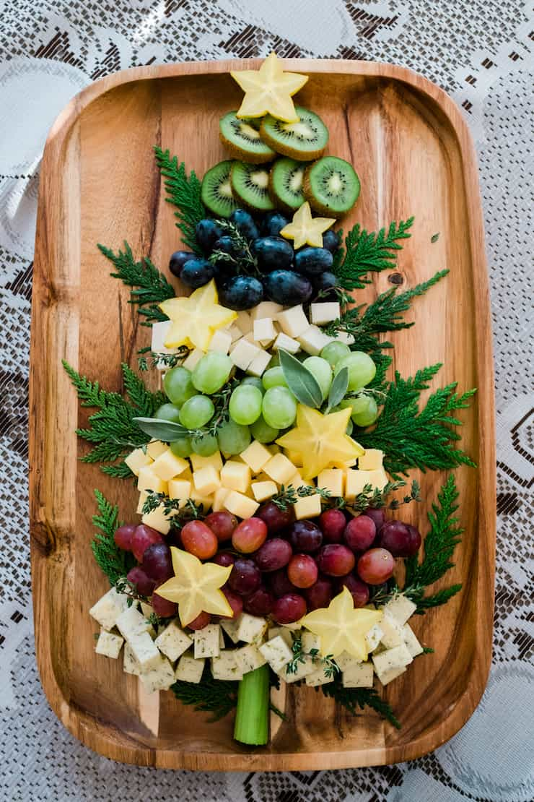

# Christmas Plan

## Food
### Raclette
- Baguette vorbestellen
- Wallnussbrot?
- Feldsalat
- Mandarinen
- Kartoffeln (2 kg)
- Cornichons
- Silberzwiebeln
- Shrimp
- Rinderfilet
- Karotten
- Champiogns
- Cherry Tomaten (bunt)
- Paprika
- Frühlingszwiebeln
- Oliven
- Trauben
- Gorgonzola
- Camembert
- Kiwis
- Karambola
- Aubergine
- Jalapenos
- Birne
- Feige 
- Feta
- Ziegenkaese
- Schwarzwaelder Schinken
- Preiselbeer Marmelade

### Buttergebäck
- 375g Butter
- 500g Mehl
- 200g Zucker
- 5 Eigelb
- Etwas Salz
### Bärentatzen

## Drinks
- Gluehwein
- Wine (white, red)
- Whiskey (Thomas)

## Games
- Settlers of Catan
- Thurn and Taxis

## Decoration
- Staender
- Christmas tree
- Tannenzapfen
- Papierketten
- Lichterketten

## Inspiration

Cheeseboard

